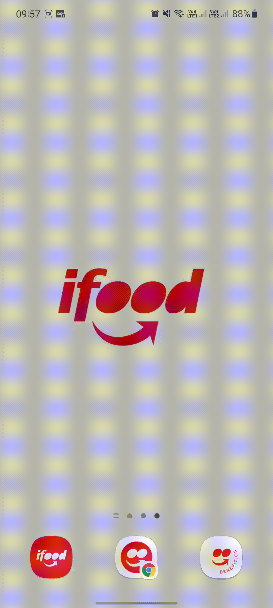
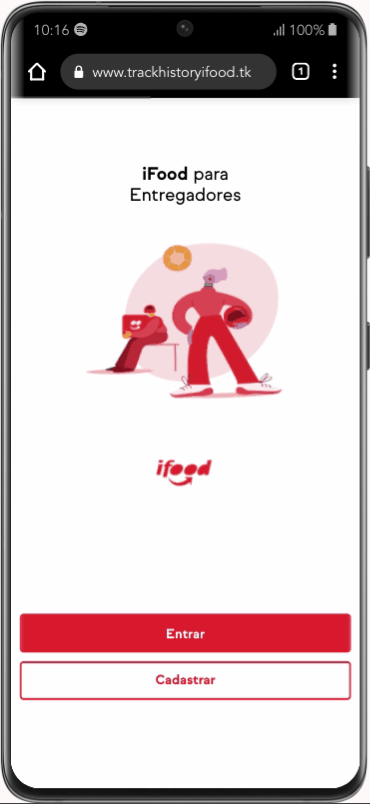
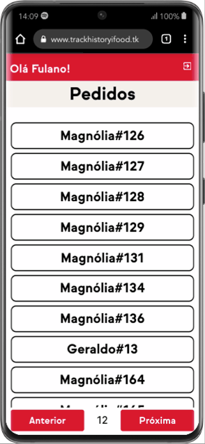

# Track History iFood

<div align="center">
<br>
</div>

## - Sobre o projeto

<p>
    O Track History iFood é uma aplicação web que permite as pessoas entregadoras selecionarem pedidos feitos por clientes e realizar sua respectiva entrega.
    O aplicativo é desenvolvido com os objetivos de facilitar o processo de entrega dessas refeições, trazer dados relevantes sobre esse processo e armazená-los.
</p>

Acesse no [trackhistoryifood.tk/](https://www.trackhistoryifood.tk/)<br>
Para o repositorio do back end acesse: [Github](https://github.com/GeraldinJr/BackendTrackHistory-iFood/tree/hml)<br>

### 💻 Desenvolvedores

- [Debora Brum](https://github.com/DeboraBrum)
- [Edvan Júnior](https://github.com/Edvan-Jr)
- [Geraldo Júnior](https://github.com/GeraldinJr)
- [Lucas Fernandes](https://github.com/lucasfpds)
- [Magnólia Medeiros](https://github.com/magnoliamedeiros)

## - Tecnologias

- [Html](https://developer.mozilla.org/pt-BR/docs/Web/HTML)
- [Css](https://developer.mozilla.org/pt-BR/docs/Web/CSS)
- [JavaScript](https://www.javascript.com/)
- [TypeScript](https://www.typescriptlang.org/)
- [ReactJS](https://reactjs.org/)
- [React Router DOM](https://reacttraining.com/react-router/)
- [MUI Styled Components](https://mui.com/pt/)
- [Eslint](https://eslint.org/)
- [Prettier](https://prettier.io/)

## Pré-requisitos

- [NodeJS](https://nodejs.org/en/download/)

<br>

```bash
#Fazer o fork do repositório para sua conta

#Executar git clone do seu fork no terminal para clonar o repositório

$ git clone https://github.com/GeraldinJr/FrontendTrackHistory-iFood.git && cd FrontendTrackHistory-iFood
```

<br>

## Passos para montar o ambiente local

1. Instalar o Yarn

```sh
npm install -g Yarn
```

3. Instalar dependências:

```sh
yarn install
```

4.  🔒 Environment

Por padrão, após a instalação das dependências a aplicação vem com um módulo de configuração que pode ler todas as variáveis ​​de ambiente do arquivo `.env`.
Utilizando de uma boa prática, a url da api que retorna e recebe todas as informações para o funcionamento do front end, e a chave da api do Google Maps que libera a utilzação da ferramenta, devem ser configuradas como variáveis de ambiente. Então, você deve configurar estas variáveis com os valores da url base do back end e a chave do Google Maps. Para isso, basta criar um arquivo `.env` com as variáveis de ambiente. Siga o exemplo abaixo:

```bash
# Crie um arquivo .env usando de exemplo o arquivo .env.example
$ cp .env.example .env
```

| Key                           | Description                 | Default Value            |
| ----------------------------- | --------------------------- | ------------------------ |
| REACT_APP_BASE_URL            | URL BASE DA API DO BACKEND  | https://exemplodeurl.com |
| REACT_APP_GOOGLE_MAPS_API_KEY | CHAVE DA API DO GOOGLE MAPS | AaBbCcDdEXEMPLO123456789 |

Para mais informações sobre variáveis de ambiente no ReactJS, acesse [ReactJS Environment Variables](https://backefront.com.br/como-criar-variavel-ambiente-react/).

5. Start da aplicação:

```sh
yarn start
```

6. Aplicação ficará disponível em **http://localhost:3000**

## - Funcionalidades

Voce poderá nessa aplicação:

- Cadastrar e fazer login de uma pessoa entregadora.
- Listar os pedidos em aberto.
  - Selecionar um pedido para entrega.
- Iniciar a entrega do pedido.
- Ver o registro do trajeto percorrido em tempo real.
  - Concluir ou Cancelar o pedido
- Deslogar da aplicação.

### 📝 Cadastro e Login

<div>


</div>
<br>
Nesta tela você poderá cadastrar e fazer login de uma pessoa entregadora registrando um nome de usuario, email e senha com no mínimo 6 caracteres. Caso um login já tenha sido feito anteriormente você será direcionado para a tela de pedidos em aberto.

### 📝 Listar os pedidos em aberto

<br>
Nesta tela você poderá listar os pedidos em aberto e escolher um para realizar a entrega.

### 📝 Iniciar a entrega do pedido

<br>
Nesta tela você terá um detalhamento do pedido e poderá iniciar a entrega.

### 📝 Ver o registro do trajeto percorrido em tempo real

<br>
Nesta Tela você poderá ver o registro do trajeto percorrido em tempo real além de concluir ou cancelar o pedido.
Em caso de fazer o logout, ou sair da aplicação por qualquer motivo com um pedido em rota, a aplicação permanecerá nessa tela até conclusão ou cancelamento do pedido. Ao entrar novamente você será redirecionado diretamente para esta tela de rastreamento.

### 📝 Deslogar da aplicação

<br>
No menu superior você poderá deslogar da aplicação. Ao sair todas as informações do usuário que foram armazenadas localmente serão apagadas.

###### tags: `Html` `Css` `React JS` `JavaScript` `TypeScript` `MUI Styled Components` `React Router DOM` `MUI Styled Components` `Eslint` `Prettier`
